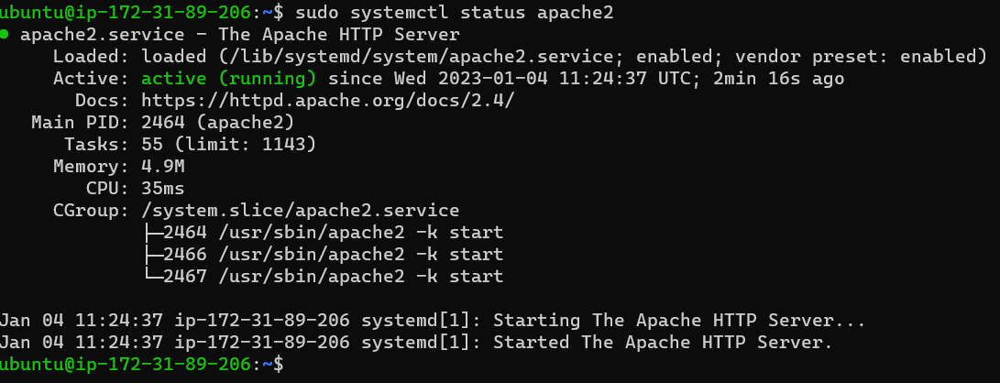

## Awesome Documentation of project 1

`sudo atp update`

`sudo install apache2`

`sudo systemctl apache2`

	- [install openssh](https://learn.microsoft.com/en-us/windows-server/administration/openssh/openssh_install_firstuse?tabs=gui)

    - [openssh-key management](https://learn.microsoft.com/en-us/windows-server/administration/manage-windows-server)

