## Awesome Documentation of project 1

# INSTALLING APACHE AND UPDATING THE FIREWALL

`sudo apt update`

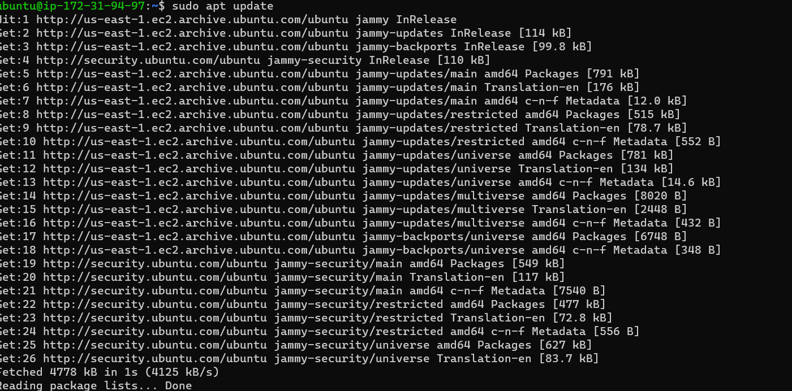

`sudo install apache2`

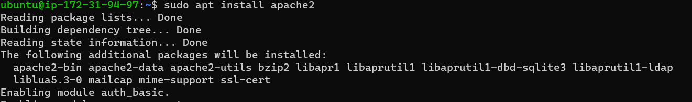

`sudo systemctl apache2`

`sudo systemctl enable apache2`

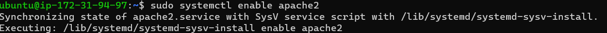

`curl localhost`

`apache2 default page`

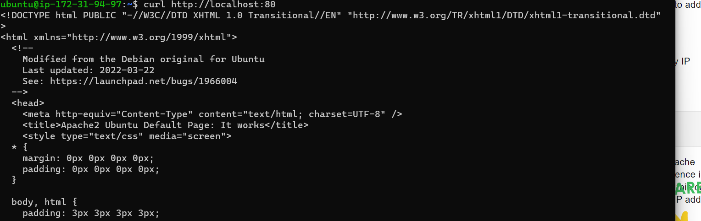

# INSTALLING MYSQL

using ‘apt’ to acquire and install this software

`sudo apt install mysql-server`

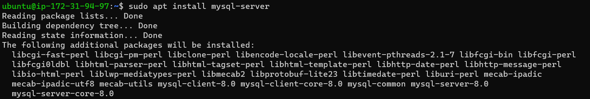

`sudo mysql`

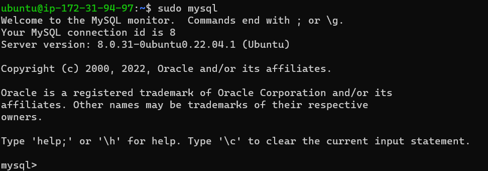

`ALTER USER root`

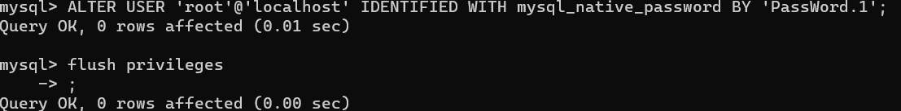

`mysql> exit`

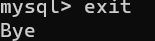

`sudo mysql secure installation`

`sudo mysql -p`

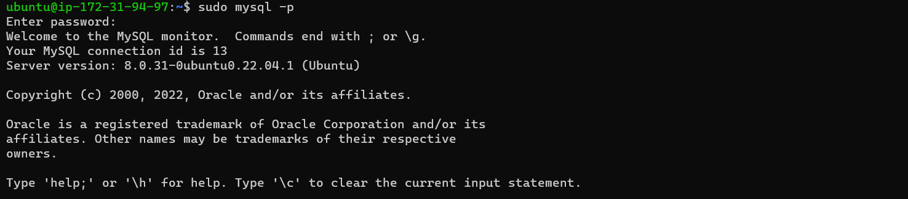

# INSTALLING PHP

You have Apache installed to serve your content and MySQL installed to store and manage your data. PHP is the component of our setup that will process code to display dynamic content to the end user. In addition to the php package, you’ll need php-mysql, a PHP module that allows PHP to communicate with MySQL-based databases. You’ll also need libapache2-mod-php to enable Apache to handle PHP files. Core PHP packages will automatically be installed as dependencies.

To install these 3 packages at once, run:

`sudo apt install php libapache2-mod-php php-mysql`

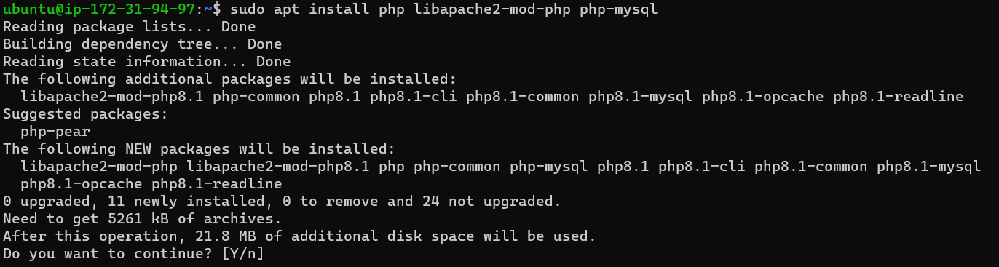

`php v`

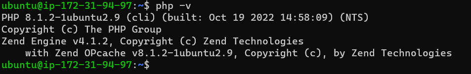

# CREATING A VIRTUAL HOST FOR YOUR WEBSITE USING APACHE

In this project, you will set up a domain called projectlamp, but you can replace this with any domain of your choice.

Apache on Ubuntu 20.04 has one server block enabled by default that is configured to serve documents from the /var/www/html directory.
We will leave this configuration as is and will add our own directory next next to the default one.

Create the directory for projectlamp using ‘mkdir’ command as follows:

`sudo mkdir var www projectlamp`

`echo` 

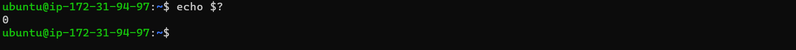

`var www`

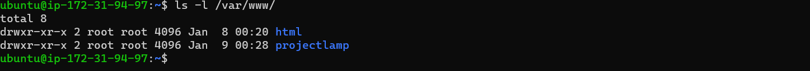

`project lamp`

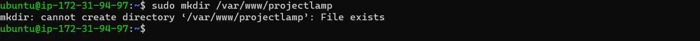

`echo 1`

` sudo chown -R $USER:$USER /var/www/projectlamp`

`sudo vi /etc/apache2/sites-available/projectlamp.conf`

`VirtualHost`

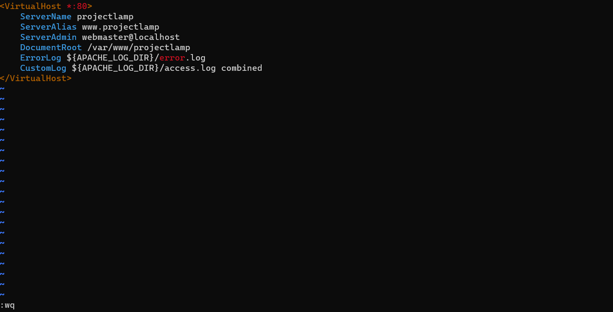

`sudo ls etc apache2 sites available`

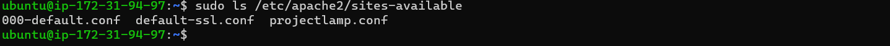

`sudo a2ensite projectlamp`

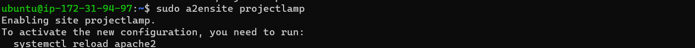

`sudo a2dissite 000-default`

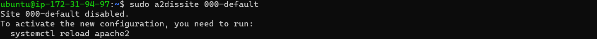

`sudo apache2ctl configtest`

`sudo systemctl reload apache2`

`sudo echo 'Hello LAMP from hostname`

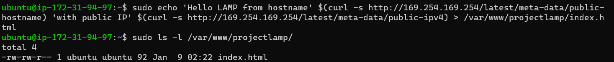

# ENABLE PHP ON THE WEBSITE

With the default DirectoryIndex settings on Apache, a file named index.html will always take precedence over an index.php file. This is useful for setting up maintenance pages in PHP applications, by creating a temporary index.html file containing an informative message to visitors. Because this page will take precedence over the index.php page, it will then become the landing page for the application. Once maintenance is over, the index.html is renamed or removed from the document root, bringing back the regular application page.

`IfModule mod_dir.c>`

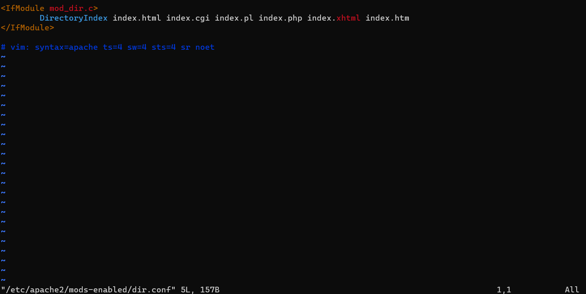

`sudo systemctl reload apache2`

`php`

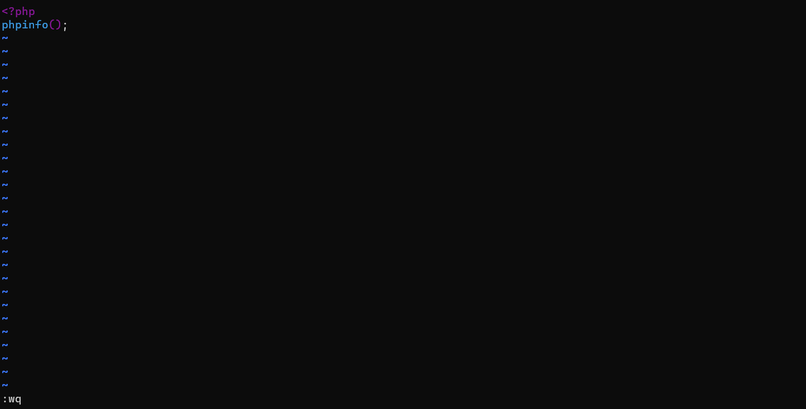

`PHP server`

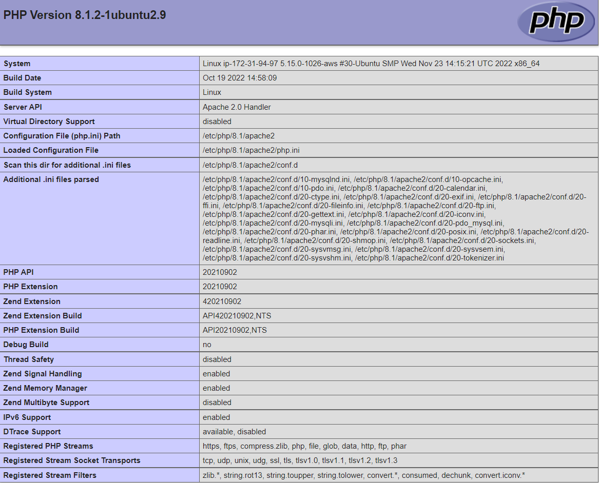

`Hello LAMP from hostname`

